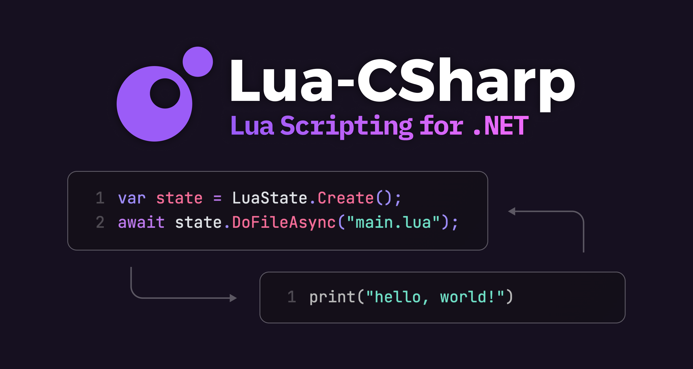
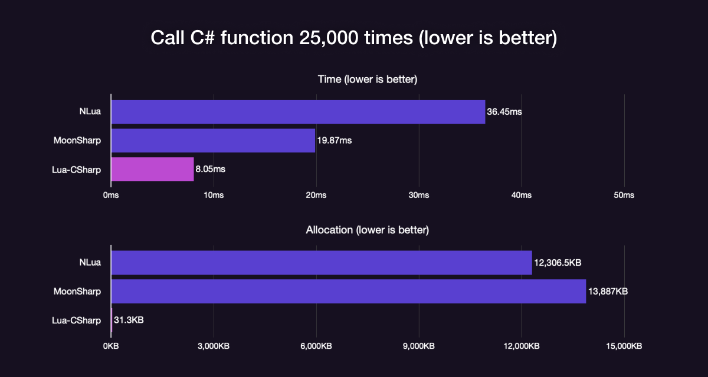

# Lua-CSharp

High performance Lua interpreter implemented in C# for .NET and Unity



[](https://www.nuget.org/packages/LuaCSharp)
[](https://github.com/AnnulusGames/Lua-CSharp/releases)
[](LICENSE)

English | [日本語](README_JA.md)

## Overview

Lua-CSharp is a library that provides a Lua interpreter implemented in C#. By integrating Lua-CSharp, you can easily embed Lua scripts into your .NET applications.

Lua-CSharp leverages the latest C# features, designed with low allocation and high performance in mind. It is optimized to deliver maximum performance when used for interoperation between C# and Lua in C# applications. Below is a benchmark comparison with [MoonSharp](https://github.com/moonsharp-devs/moonsharp/) and [NLua](https://github.com/NLua/NLua):



MoonSharp generally provides good speed but incurs significant allocations due to its design. NLua, being a C-binding implementation, is fast, but introduces substantial overhead when interacting with the C# layer. Lua-CSharp, fully implemented in C#, allows for seamless interaction with C# code without additional overhead. Moreover, it operates reliably in AOT environments since it does not rely on IL generation.

## Features

* Lua 5.2 interpreter implemented in C#
* Easy-to-use API integrated with async/await
* Support for exception handling with try-catch
* High-performance implementation utilizing modern C#
* Unity support (works with both Mono and IL2CPP)

## Installation

### NuGet packages

To use Lua-CSharp, .NET Standard 2.1 or higher is required. The package can be obtained from NuGet.

### .NET CLI

```ps1
dotnet add package LuaCSharp
```

### Package Manager

```ps1
Install-Package LuaCSharp
```

### Unity

Lua-CSharp can also be used in Unity (works with both Mono and IL2CPP).

### Requirements

* Unity 2021.3 or higher

### Installation

1. Install [NugetForUnity](https://github.com/GlitchEnzo/NuGetForUnity).
2. Open the NuGet window by going to `NuGet > Manage NuGet Packages`, search for the `LuaCSharp` package, and install it.

## Quick Start

By using the `LuaState` class, you can execute Lua scripts from C#. Below is a sample code that evaluates a simple calculation written in Lua.

```cs
using Lua;

// Create a LuaState
var state = LuaState.Create();

// Execute a Lua script string with DoStringAsync
var results = await state.DoStringAsync("return 1 + 1");

// 2
Console.WriteLine(results[0]);
```

> [!WARNING]
> `LuaState` is not thread-safe. Do not access it from multiple threads simultaneously.

## LuaValue

Values in Lua scripts are represented by the `LuaValue` type. The value of a `LuaValue` can be read using `TryRead<T>(out T value)` or `Read<T>()`.

```cs
var results = await state.DoStringAsync("return 1 + 1");

// double
var value = results[0].Read<double>();
```

You can also get the type of the value from the `Type` property.

```cs
var isNil = results[0].Type == LuaValueType.Nil;
```

Below is a table showing the type mapping between Lua and C#.

| Lua        | C#                |
| ---------- | ----------------- |
| `nil`      | `LuaValue.Nil`    |
| `boolean`  | `bool`            |
| `string`   | `string`          |
| `number`   | `double`, `float` |
| `table`    | `LuaTable`        |
| `function` | `LuaFunction`     |
| `userdata` | `LuaUserData`     |
| `thread`   | `LuaThread`       |

When creating a `LuaValue` from the C# side, compatible types are implicitly converted into `LuaValue`.

```cs
LuaValue value;
value = 1.2;           // double   ->  LuaValue
value = "foo";         // string   ->  LuaValue
value = new LuaTable() // LuaTable ->  LuaValue
```

## LuaTable

Lua tables are represented by the `LuaTable` type. They can be used similarly to `LuaValue[]` or `Dictionary<LuaValue, LuaValue>`.

```cs
// Create a table in Lua
var results = await state.DoStringAsync("return { a = 1, b = 2, c = 3 }");
var table1 = results[0].Read<LuaTable>();

// 1
Console.WriteLine(table1["a"]);

// Create a table in C#
results = await state.DoStringAsync("return { 1, 2, 3 }");
var table2 = results[0].Read<LuaTable>();

// 1 (Note: Lua arrays are 1-indexed)
Console.WriteLine(table2[1]);
```

## Global Environment

You can access Lua's global environment through `state.Environment`. This table allows for easy value exchange between Lua and C#.

```cs
// Set a = 10
state.Environment["a"] = 10;

var results = await state.DoStringAsync("return a");

// 10
Console.WriteLine(results[0]);
```

## Standard Libraries

You can use Lua's standard libraries as well. By calling `state.OpenStandardLibraries()`, the standard library tables are added to the `LuaState`.

```cs
using Lua;
using Lua.Standard;

var state = LuaState.Create();

// Add standard libraries
state.OpenStandardLibraries();

var results = await state.DoStringAsync("return math.pi");
Console.WriteLine(results[0]); // 3.141592653589793
```

For more details on standard libraries, refer to the [Lua official manual](https://www.lua.org/manual/5.2/manual.html#6).

> [!WARNING]
> Lua-CSharp does not support all functions of the standard libraries. For details, refer to the [Compatibility](#compatibility) section.

## Functions

Lua functions are represented by the `LuaFunction` type. With `LuaFunction`, you can call Lua functions from C#, or define functions in C# that can be called from Lua.

### Calling Lua Functions from C#

```lua
-- lua2cs.lua

local function add(a, b)
    return a + b
end

return add;
```

```cs
var results = await state.DoFileAsync("lua2cs.lua");
var func = results[0].Read<LuaFunction>();

// Execute the function with arguments
var funcResults = await func.InvokeAsync(state, new[] { 1, 2 });

// 3
Console.WriteLine(funcResults[0]);
```

### Calling C# Functions from Lua

It is possible to create a `LuaFunction` from a lambda expression.

```cs
// Add the function to the global environment
state.Environment["add"] = new LuaFunction((context, buffer, ct) =>
{
    // Get the arguments using context.GetArgument<T>()
    var arg0 = context.GetArgument<double>(0);
    var arg1 = context.GetArgument<double>(1);

    // Write the return value to the buffer
    buffer.Span[0] = arg0 + arg1;

    // Return the number of values
    return new(1);
});

// Execute a Lua script
var results = await state.DoFileAsync("cs2lua.lua");

// 3
Console.WriteLine(results[i]);
```

```lua
-- cs2lua.lua

return add(1, 2)
```

Additionally, `LuaFunction` operates asynchronously. Therefore, you can define a function that waits for an operation in Lua, such as the example below:

```cs
// Define a function that waits for the given number of seconds using Task.Delay
state.Environment["wait"] = new LuaFunction(async (context, buffer, ct) =>
{
    var sec = context.GetArgument<double>(0);
    await Task.Delay(TimeSpan.FromSeconds(sec));
    return 0;
});

await state.DoFileAsync("sample.lua");
```

```lua
-- sample.lua

-- The incremented value will be printed to the console every second
local i = 0
while true do
    i = i + 1
    print(i)
    wait(1.0)
end
```

## Coroutines

Lua coroutines are represented by the `LuaThread` type.

Coroutines can not only be used within Lua scripts, but you can also await Lua-created coroutines from C#.

```lua
-- coroutine.lua

local co = coroutine.create(function()
    for i = 1, 10 do
        print(i)
        coroutine.yield()
    end
end)

return co
```

```cs
var results = await state.DoFileAsync("coroutine.lua");
var co = results[0].Read<LuaThread>();

for (int i = 0; i < 10; i++)
{
    var resumeResults = await co.ResumeAsync(state);

    // Similar to coroutine.resume(), returns true on success and the return values afterward
    // 1, 2, 3, 4, ...
    Console.WriteLine(resumeResults[1]);
}
```

## Module Loading

In Lua, you can load modules using the `require` function. In regular Lua, modules are managed by searchers within the `package.searchers` function list. In Lua-CSharp, this is replaced by the `ILuaModuleLoader` interface.

```cs
public interface ILuaModuleLoader
{
    bool Exists(string moduleName);
    ValueTask<LuaModule> LoadAsync(string moduleName, CancellationToken cancellationToken = default);
}
```

You can set the `LuaState.ModuleLoader` to change how modules are loaded. By default, the `FileModuleLoader` is set to load modules from Lua files.

You can also combine multiple loaders using `CompositeModuleLoader.Create(loader1, loader2, ...)`.

```cs
state.ModuleLoader = CompositeModuleLoader.Create(
    new FileModuleLoader(),
    new CustomModuleLoader()
);
```

Loaded modules are cached in the `package.loaded` table, just like regular Lua. This can be accessed via `LuaState.LoadedModules`.

## Exception Handling

Lua script parsing errors and runtime exceptions throw exceptions that inherit from `LuaException`. You can catch these to handle errors during execution.

```cs
try
{
    await state.DoFileAsync("filename.lua");
}
catch (LuaParseException)
{
    // Handle parsing errors
}
catch (LuaRuntimeException)
{
    // Handle runtime exceptions
}
```

## Compatibility

Lua-CSharp is designed with integration into .NET in mind, so there are several differences from the C implementation.

### Binary

Lua-CSharp does not support Lua bytecode (tools like `luac` cannot be used). Only Lua source code can be executed.

### Character Encoding

The character encoding used in Lua-CSharp is UTF-16. Since standard Lua assumes a single-byte character encoding, string behavior differs significantly.

For example, in regular Lua, the following code outputs `15`, but in Lua-CSharp, it outputs `5`.

```lua
local l = string.len("あいうえお")
print(l)
```

All string library functions handle strings as UTF-16.

### Garbage Collection

Since Lua-CSharp is implemented in C#, it relies on .NET's garbage collector. As a result, memory management behavior differs from regular Lua.

While `collectgarbage()` is available, it simply calls the corresponding .NET garbage collection method and may not exhibit the same behavior as C's Lua garbage collector.

## License

Lua-CSharp is licensed under the [MIT License](LICENSE).
